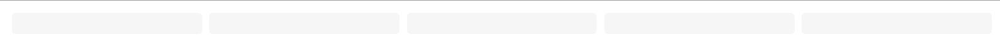

# UI 库正在开发中

## 安装

```
npm i vue-wang-view
```

## 使用

```
// 骨架屏
import vueWangIview from "vue-wang-iview"
import "vue-wang-iview/dist/vue-wang-iview.css"
Vue.use(vueWangIview)
```


# WangSkeleton

### <font color='red'>使用说明:</font>

> 除了 `custom` 类型，其他的类型一行只能显示同一种样式； `custom ` 的类型，一行可以随意组装任何的样式。
>
> 百分比单位不推荐使用，推荐使用 （vw，vh，rem，px，rpx）单位
>
> 外间距（itemRowMargin，itemColumnMargin，itemMargin）间距最多支持 4个参数，对接原生css属性【上右下左】原则（0px 10px 5px 3px）

### 头像【√】

 

#### options

| API              | 内容             | 类型    | 默认值     | 备注                                                         | 必选 |
| ---------------- | ---------------- | ------- | ---------- | ------------------------------------------------------------ | ---- |
| row              | 行               | Number  | 1          |                                                              | 否   |
| column           | 列               | Number  | 1          |                                                              | 否   |
| width            | 每个线条宽       | String  | 600px      | 可以设置百分比布局（100%）                                   | 否   |
| height           | 每个线条高       | String  | 20px       | 不支持设置百分比布局                                         | 否   |
| backgroundColor  | 线条背景颜色     | String  | #F2F2F2    |                                                              | 否   |
| justifyContent   | 水平对齐方式     | String  | flex-start |                                                              | 否   |
| alignItems       | 垂直对齐方式     | String  | center     |                                                              | 否   |
| itemRowMargin    | 每个行外边距     | String  | 0px        | 间距最多支持 4个参数，对接原生css属性【上右下左】原则（0px 10px 5px 3px） | 否   |
| itemColumnMargin | 每个列外边距     | String  | 0px        | 间距最多支持 4个参数，对接原生css属性【上右下左】原则（0px 10px 5px 3px） | 否   |
| itemMargin       | 每个头像间外间距 | String  | 0 5px      | 间距最多支持 4个参数，对接原生css属性【上右下左】原则（0px 10px 5px 3px） | 否   |
| active           | 是否动画         | Boolean | false      |                                                              | 否   |

> 使用

```
<Wang-skeleton type="avatar" :options="{active:true}" v-show="pictLoading" style="background-color:#fff;height:100vh"/>
```


```js
  // 头像
        options: {
            // 行数(默认:1)
            row: 1,
            // 列数(默认:1)
            column: 1,
            // 每个元素宽(默认40)
            // width: "40px",
            // 每个元素的高(默认40)
            // height: "40px",
            // 背景颜色(有默认)
            // backgroundColor: "#ccc",
            // 水平对齐方式(默认:左)
            // justifyContent: "flex-start",
            // 垂直对齐方式(默认:center)
            // alignItems: "center",
            // 是否动画(默认:无)
            active: true,
            // 行间距(默认: 0)
            // itemRowMargin: "0",
            // 列间距(默认: 0)
            // itemColumnMargin: "0",
            // 每个头像间外间距（默认：0 5px）
            // itemMargin: "0 5px",
          },
```

### 分割线



#### options

| API              | 内容             | 类型    | 默认值     | 备注                       | 必选 |
| ---------------- | ---------------- | ------- | ---------- | -------------------------- | ---- |
| row              | 行               | Number  | 1          |                            | 否   |
| column           | 列               | Number  | 1          |                            | 否   |
| width            | 每个线条宽       | String  | 600px      | 可以设置百分比布局（100%） | 否   |
| height           | 每个线条高       | String  | 20px       | 不支持设置百分比布局       | 否   |
| backgroundColor  | 线条背景颜色     | String  | #F2F2F2    |                            | 否   |
| justifyContent   | 水平对齐方式     | String  | flex-start |                            | 否   |
| active           | 是否动画         | Boolean | false      |                            | 否   |
| itemRowMargin    | 每个线条行外边距 | String  | 5px        |                            | 否   |
| itemColumnMargin | 每个线条列外边距 | String  | 5px        |                            | 否   |

> 使用

```
<Wang-skeleton type='line'  :options="options"  />
```

```
 options: {
        // 行数(默认:1)
        row: 1,
        // 列数(默认:1)
        column: 5,
        // 每个元素宽(默认:600)
        // width: "600px",
        // 每个元素的高(默认:30)
        height: "30px",
        // 背景颜色(有默认)
        // backgroundColor: "#ccc",
        // 对齐方式(默认:左)
        // justifyContent: "center",
        // 是否动画(默认:无)
        active: true,
        // 设置成 100% 后，一行所有的块平均分布样式
        width:'100%',
        // 行间距(默认:10)
        // itemRowMargin: "10px",
        // 列间距(默认: 0)
        // itemColumnMargin: "0px",
        // 垂直对齐方式(默认:center)
        // alignItems: "center",
      },
```


### 列表【√】

 

#### options

| API              |       内容       | 类型    | 默认值                                | 备注                                                         | 必选 |
| ---------------- | :--------------: | ------- | ------------------------------------- | ------------------------------------------------------------ | ---- |
| row              |        行        | Number  | 4                                     |                                                              | 否   |
| column           |        列        | Number  | 1                                     |                                                              | 否   |
| width            |    每个线条宽    | String  | 600px                                 |                                                              | 否   |
| height           |    每个线条高    | String  | 20px                                  |                                                              | 否   |
| backgroundColor  |   线条背景颜色   | String  | #F2F2F2                               |                                                              | 否   |
| justifyContent   |   水平对齐方式   | String  | flex-start                            |                                                              | 否   |
| active           |     是否动画     | Boolean | false                                 |                                                              | 否   |
| itemRowMargin    | 每个线条行外边距 | String  | 10px                                  |                                                              | 否   |
| itemColumnMargin | 每个线条列外边距 | String  | 0px                                   |                                                              | 否   |
| firstWidth       |  列表的首条宽度  | String  | width的默认宽度 - 40%则是默认首条宽度 | 如果不设置首条宽度，则使用设置的 `width`的宽度 - 40%，即为首条的默认宽度，如果设定首条宽度，需要指定 固定 `px` 单位或使用 calc 计算 | 否   |
|                  |                  |         |                                       |                                                              |      |


```

```


### 卡片【√】

 

#### option

| API              | 内容             | 类型    | 默认值     | 备注                                                         | 必选 |
| ---------------- | ---------------- | ------- | ---------- | ------------------------------------------------------------ | ---- |
| row              | 行               | Number  | 1          | 当使用多（row）行时，需要使用 `itemRowMargin` 参数           | 否   |
| column           | 列               | Number  | 1          | 当使用多（row）行时，需要使用 `itemColumnMargin` 参数        | 否   |
| width            | 每个线条宽       | String  | 30px       |                                                              | 否   |
| height           | 每个线条高       | String  | 30px       |                                                              | 否   |
| backgroundColor  | 线条背景颜色     | String  | #F2F2F2    |                                                              | 否   |
| justifyContent   | 水平对齐方式     | String  | flex-start |                                                              | 否   |
| active           | 是否动画         | Boolean | false      |                                                              | 否   |
| itemRowMargin    | 每个线条行外边距 | String  | 0px        | 当使用多（row）行时，需要使用此参数                          | 否   |
| itemColumnMargin | 每个线条列外边距 | String  | 0px        | 当使用多（column）行时，需要使用此参数                       | 否   |
| itemMargin       | 每个卡片间外间距 | String  | 0 5px      | 间距最多支持 4个参数，对接原生css属性【上右下左】原则（0px 10px 5px 3px） | 否   |

> 使用

```
<Wang-skeleton type='card'  :options="options"  />
```


```
 // 卡片
           options: {
            // 行数(默认:1)
            // row: 1,
            // 列数(默认:1)
            column: 2,
            // 每个元素宽(默认:30)
            // width: "30px",
            // 每个元素的高(默认:30)
            // height: "30px",
            // 背景颜色(有默认)
            // backgroundColor: "#ccc",
            // 对齐方式(默认:左)
            // justifyContent: "flex-start",
            // 是否动画(默认:无)
            active: true,
            // 行间距(默认:0)
            // itemRowMargin: "5px",
            // 列间距(默认: 0)
            itemColumnMargin: "5px",
            // 垂直对齐方式(默认:center)
            // alignItems: "center",
            // 每个卡片间外间距（默认: 0 5px）
            // itemMargin: "0 5px",
          },
```

### 全局属性

```
 <WangSkeleton height="500px" :options="options" />
```

#### options

|       API       |        内容        |  类型  |              值              | 默认值 | 必选 |
| :-------------: | :----------------: | :----: | :--------------------------: | :----: | ---- |
|      type       |      显示类型      | String | avatar/line/list/card/custom |  list  | 是   |
|     options     |     全局设置项     | Object |              {}              |   {}   | 否   |
| childrenOption  |   设置子组件类型   | Array  |              []              |   []   | 否   |
|      width      |       模块宽       | String |            100px             |   ''   | 否   |
|     height      |       模块高       | String |            100px             |   ''   | 否   |
| backgroundColor | 背景颜色（调试用） | String |             red              |   ''   | 否   |


### 自定义

>  **注意：**
>
>  自定义的类型，（高度，宽度）不支持设置百分比单位，可以设置 （vw）单位，高度单位推荐固定 `px` 单位
>
> 需要设置响应式大小，项目需要启动 （rem） 布局(如果你的项目使用的非rem布局，rem则默认使用的你项目的跟标签 html 的文字大小，是不支持缩放的)


|      API       |      内容      |  类型   |              值              | 默认值 |
| :------------: | :------------: | :-----: | :--------------------------: | :----: |
|      type      |    显示类型    | String  | avatar/line/list/card/custom |        |
|    options     |   全局设置项   | Object  |              {}              |   {}   |
| childrenOption | 设置子组件类型 |  Array  |              []              |        |
|   isUseSlot    |  是否使用插槽  | Boolean |          false/true          | false  |
|                |                |         |                              |        |


```
 <WangSkeleton :childrenOption="childrenOption" type="custom"  />
```

#### options

* 全局配置项可以全部不设置，在每个子组件中都有默认值使用
*  传全局的配置就使用全局的配置,没有就用单独的每个item的配置(每个item的配置优先级高)

|       API        |   内容   |  类型  |
| :--------------: | :------: | :----: |
| backgroundColor  | 背景颜色 | String |
|      active      |          |        |
|  itemRowMargin   |          |        |
| itemColumnMargin |          |        |
|    alignItems    |          |        |
|  justifyContent  |          |        |
|      height      |          |        |
|      width       |          |        |
|       row        |          |        |


```
// 全局配置
      options: {
        // 背景颜色
        backgroundColor: "red",
        // 是否动画
        active: false,
      },
```

#### childrenOption

```js
 childrenOption: [
        // 头像
        {
          type: "avatar",
          options: {
            // 行数(默认:1)
            row: 1,
            // 列数(默认:1)
            column: 1,
            // 每个元素宽(默认40)
            width: "40px",
            // 每个元素的高(默认40)
            height: "40px",
            // 背景颜色(有默认)
            backgroundColor: "#ccc",
            // 水平对齐方式(默认:左)
            justifyContent: "flex-start",
            // 垂直对齐方式(默认:center)
            alignItems: "center",
            // 是否动画(默认:无)
            active: true,
            // 行间距(默认: 10)
            itemRowMargin: "10px",
            // 列间距(默认: 0)
            itemColumnMargin: "0px",
          },
        },
        // 分割线
        {
          type: "line",
          options: {
            //  行
            row: 2,
            // 列
            column: 2,
            width: "120px",
            height: "20px",
            backgroundColor: "#ccc",
            justifyContent: "flex-start",
            // 垂直对齐方式(默认:center)
            alignItems: "center",
            // 是否动画
            active: true,
            // 行间距(默认:10)
            itemRowMargin: "10px",
            // 列间距(默认: 0)
            itemColumnMargin: "0px",
          },
        },
        // 卡片
        {
          type: "card",
          options: {
            // 行数(默认:1)
            row: 2,
            // 列数(默认:1)
            column: 2,
            // 每个元素宽(默认:30)
            width: "30px",
            // 每个元素的高(默认:30)
            height: "30px",
            // 背景颜色(有默认)
            backgroundColor: "#ccc",
            // 对齐方式(默认:左)
            justifyContent: "flex-start",
            // 是否动画(默认:无)
            active: true,
             // 行间距(默认:10)
            itemRowMargin: "10px",
            // 列间距(默认: 0)
            itemColumnMargin: "0px",
            // 垂直对齐方式(默认:center)
            alignItems: "center",
          },
        },
        // 列表
        {
          type: "list",
          options: {
            // 行数(默认:1)
            row: 3,
            // 列数(默认:1)
            column: 1,
            // 每个元素宽(默认600)
            width: "600px",
            // 每个元素的高(默认20)
            height: "20px",
            // 背景颜色(默认: #F2F2F2)
            backgroundColor: "#ccc",
            // item 对齐方式(默认:左)
            justifyContent: "center",
            // 是否动画(默认:无)
            active: true,
            // 行间距
            itemRowMargin: "10px",
            // 列间距(默认: 0)
            itemColumnMargin: "0px",
            // 首条宽度(默认100)
            firstWidth: "300px",
            // 末条宽度(默认 '')
            // lastWidth: "300px",
            // 垂直对齐方式(默认:center)
            alignItems: "center",
          },
        },
      ],
```

