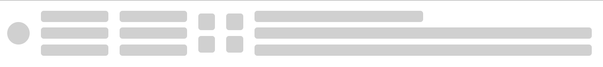

# UI 库正在开发中

## 安装

```
npm i vue-wang-view
```

## 使用

```
// 骨架屏
import vueWangIview from "vue-wang-iview"
import "vue-wang-iview/dist/vue-wang-iview.css"
Vue.use(vueWangIview)
```


# WangSkeleton

### 头像

 

```js
<Wang-skeleton type="avatar" :options="{active:true}" v-show="pictLoading" style="background-color:#fff;height:100vh"/>
   
 // 头像
        {
          type: "avatar",
          options: {
            // 行数(默认:1)
            row: 1,
            // 列数(默认:1)
            column: 1,
            // 每个元素宽(默认40)
            width: "40px",
            // 每个元素的高(默认40)
            height: "40px",
            // 背景颜色(有默认)
            backgroundColor: "#ccc",
            // 水平对齐方式(默认:左)
            justifyContent: "flex-start",
            // 垂直对齐方式(默认:center)
            alignItems: "center",
            // 是否动画(默认:无)
            active: true,
            // 行间距(默认: 10)
            itemRowMargin: "10px",
            // 列间距(默认: 0)
            itemColumnMargin: "0px",
          },
        },
```

### 分割线

 

```
// 分割线
        {
          type: "line",
          options: {
            //  行
            row: 2,
            // 列
            column: 2,
            width: "120px",
            height: "20px",
            backgroundColor: "#ccc",
            justifyContent: "flex-start",
            // 垂直对齐方式(默认:center)
            alignItems: "center",
            // 是否动画
            active: true,
            itemRowMargin: "10px",
            // 列间距(默认: 0)
            itemColumnMargin: "0px",
          },
        },
```


### 列表

 

options

| API              | 内容             | 类型    | 默认值     |
| ---------------- | ---------------- | ------- | ---------- |
| row              | 行               | Number  | 4          |
| column           | 列               | Number  | 1          |
| width            | 每个线条宽       | String  | 600px      |
| height           | 每个线条高       | String  | 20px       |
| backgroundColor  | 线条背景颜色     | String  | #F2F2F2    |
| justifyContent   | 水平对齐方式     | String  | flex-start |
| active           | 是否动画         | Boolean | false      |
| itemRowMargin    | 每个线条行外边距 | String  | 10px       |
| itemColumnMargin | 每个线条列外边距 | String  | 0px        |
| firstWidth       | 首条宽度         | String  | 200px      |
| lastWidth        | 尾条宽度         | String  | ''         |
| alignItems       | 垂直对齐方式     | String  | center     |

使用

```
options: {
            active: true,
          }
```


### 卡片

 

```
 // 卡片
        {
          type: "card",
          options: {
            // 行数(默认:1)
            row: 2,
            // 列数(默认:1)
            column: 2,
            // 每个元素宽(默认:30)
            width: "30px",
            // 每个元素的高(默认:30)
            height: "30px",
            // 背景颜色(有默认)
            backgroundColor: "#ccc",
            // 对齐方式(默认:左)
            justifyContent: "flex-start",
            // 是否动画(默认:无)
            active: true,
             // 行间距(默认:10)
            itemRowMargin: "10px",
            // 列间距(默认: 0)
            itemColumnMargin: "0px",
            // 垂直对齐方式(默认:center)
            alignItems: "center",
          },
        },
```

### 全局属性

```
 <WangSkeleton height="500px" :options="options" />
```

|       API       |        内容        |  类型   |              值              | 默认值 |
| :-------------: | :----------------: | :-----: | :--------------------------: | :----: |
|      type       |      显示类型      | String  | avatar/line/list/card/custom |  list  |
|     options     |     全局设置项     | Object  |              {}              |   {}   |
| childrenOption  |   设置子组件类型   |  Array  |              []              |   []   |
|    isUseSlot    |    是否使用插槽    | Boolean |          false/true          | false  |
|      width      |       模块宽       | String  |            100px             |   ''   |
|     height      |       模块高       | String  |            100px             |   ''   |
| backgroundColor | 背景颜色（调试用） | String  |             red              |   ''   |


### 自定义

 

|      API       |      内容      |  类型   |              值              | 默认值 |
| :------------: | :------------: | :-----: | :--------------------------: | :----: |
|      type      |    显示类型    | String  | avatar/line/list/card/custom |        |
|    options     |   全局设置项   | Object  |              {}              |   {}   |
| childrenOption | 设置子组件类型 |  Array  |              []              |        |
|   isUseSlot    |  是否使用插槽  | Boolean |          false/true          | false  |
|                |                |         |                              |        |


```
 <WangSkeleton :childrenOption="childrenOption" type="custom"  />
```

#### options

* 全局配置项可以全部不设置，在每个子组件中都有默认值使用
*  传全局的配置就使用全局的配置,没有就用单独的每个item的配置(每个item的配置优先级高)

|       API        |   内容   |  类型  |
| :--------------: | :------: | :----: |
| backgroundColor  | 背景颜色 | String |
|      active      |          |        |
|  itemRowMargin   |          |        |
| itemColumnMargin |          |        |
|    alignItems    |          |        |
|  justifyContent  |          |        |
|      height      |          |        |
|      width       |          |        |
|       row        |          |        |


```
// 全局配置
      options: {
        // 背景颜色
        backgroundColor: "red",
        // 是否动画
        active: false,
      },
```

#### childrenOption

```js
 childrenOption: [
        // 头像
        {
          type: "avatar",
          options: {
            // 行数(默认:1)
            row: 1,
            // 列数(默认:1)
            column: 1,
            // 每个元素宽(默认40)
            width: "40px",
            // 每个元素的高(默认40)
            height: "40px",
            // 背景颜色(有默认)
            backgroundColor: "#ccc",
            // 水平对齐方式(默认:左)
            justifyContent: "flex-start",
            // 垂直对齐方式(默认:center)
            alignItems: "center",
            // 是否动画(默认:无)
            active: true,
            // 行间距(默认: 10)
            itemRowMargin: "10px",
            // 列间距(默认: 0)
            itemColumnMargin: "0px",
          },
        },
        // 分割线
        {
          type: "line",
          options: {
            //  行
            row: 2,
            // 列
            column: 2,
            width: "120px",
            height: "20px",
            backgroundColor: "#ccc",
            justifyContent: "flex-start",
            // 垂直对齐方式(默认:center)
            alignItems: "center",
            // 是否动画
            active: true,
            // 行间距(默认:10)
            itemRowMargin: "10px",
            // 列间距(默认: 0)
            itemColumnMargin: "0px",
          },
        },
        // 卡片
        {
          type: "card",
          options: {
            // 行数(默认:1)
            row: 2,
            // 列数(默认:1)
            column: 2,
            // 每个元素宽(默认:30)
            width: "30px",
            // 每个元素的高(默认:30)
            height: "30px",
            // 背景颜色(有默认)
            backgroundColor: "#ccc",
            // 对齐方式(默认:左)
            justifyContent: "flex-start",
            // 是否动画(默认:无)
            active: true,
             // 行间距(默认:10)
            itemRowMargin: "10px",
            // 列间距(默认: 0)
            itemColumnMargin: "0px",
            // 垂直对齐方式(默认:center)
            alignItems: "center",
          },
        },
        // 列表
        {
          type: "list",
          options: {
            // 行数(默认:1)
            row: 3,
            // 列数(默认:1)
            column: 1,
            // 每个元素宽(默认600)
            width: "600px",
            // 每个元素的高(默认20)
            height: "20px",
            // 背景颜色(默认: #F2F2F2)
            backgroundColor: "#ccc",
            // item 对齐方式(默认:左)
            justifyContent: "center",
            // 是否动画(默认:无)
            active: true,
            // 行间距
            itemRowMargin: "10px",
            // 列间距(默认: 0)
            itemColumnMargin: "0px",
            // 首条宽度(默认100)
            firstWidth: "300px",
            // 末条宽度(默认 '')
            // lastWidth: "300px",
            // 垂直对齐方式(默认:center)
            alignItems: "center",
          },
        },
      ],
```

